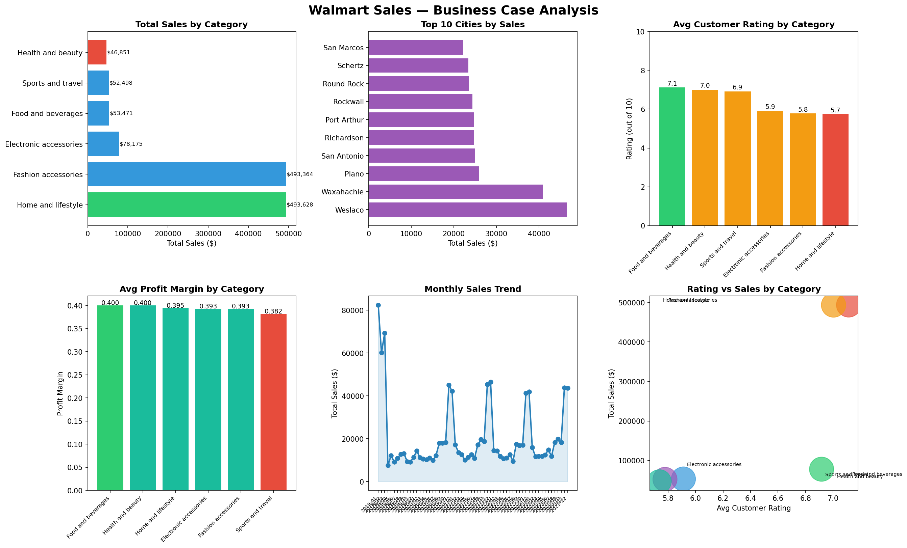

# Walmart Sales — Business Case Analysis


## Project Overview
A full business case analysis of 10,051 Walmart transactions across 
Texas locations. The goal was to identify underperforming categories 
and regions and provide actionable recommendations — just like a 
real business analyst would deliver to management.

**Business Question:** Which product categories and cities are 
underperforming, and what should Walmart do about it?

## Key Findings
| Category | Total Sales | Avg Rating | Profit Margin |
|---|---|---|---|
| Home and lifestyle | $493,628 | 5.74/10 ⚠️ | 0.39 |
| Fashion accessories | $493,363 | 5.78/10 ⚠️ | 0.39 |
| Food and beverages | $53,471 | 7.11/10 ✅ | 0.40 ✅ |
| Health and beauty | $46,851 | 7.00/10 ✅ | 0.40 ✅ |

**Critical insight:** Top-selling categories have the lowest customer 
ratings. High-rated categories are significantly underselling.

## Dashboard


## Recommendations
See [recommendation.md](recommendation.md) for the full business report.

**Summary:**
- Fix product quality in Home and lifestyle (rating 5.74 → 7.0+)
- Increase marketing budget for Food and beverages (highest margin)
- Replicate Weslaco/Waxahachie sales strategies in other cities

## Tech Stack
- Python 3.13
- Pandas — data cleaning and analysis
- Matplotlib & Seaborn — data visualization

## Dataset
Download the dataset from Kaggle:
[Walmart 10K Sales Dataset](https://www.kaggle.com/datasets/najir0123/walmart-10k-sales-datasets)

## How to Run
```bash
pip install pandas matplotlib seaborn
python business.py
```

## Author
**Rohan Thapa** — Business Analytics & Information Systems
